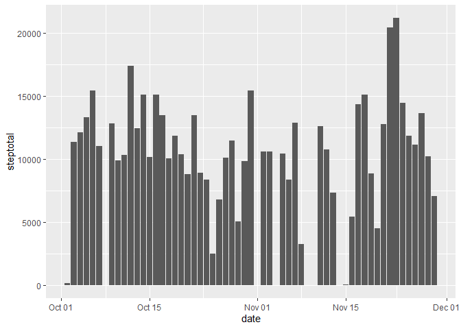
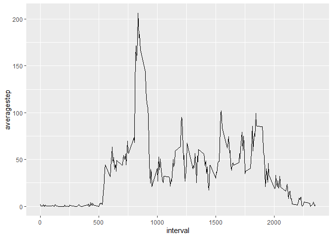
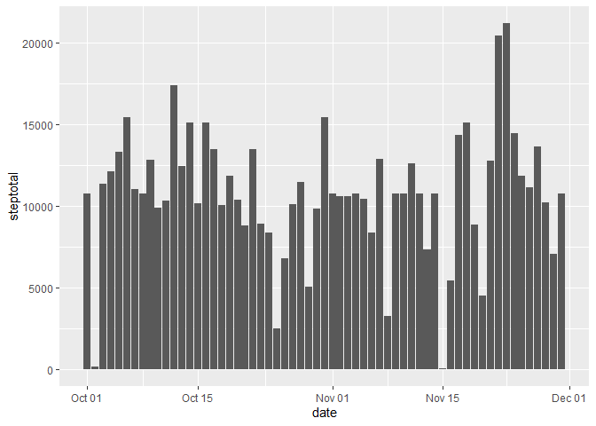
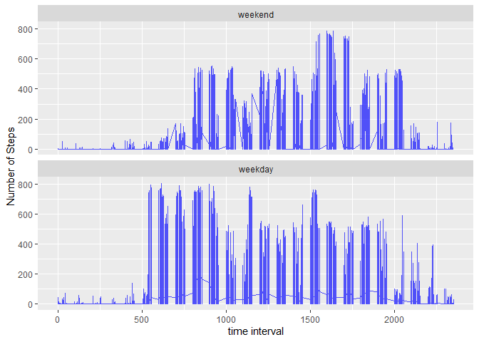

First we add the required libraries.

```r
library(ggplot2)
library(tidyverse)
library(lubridate)
```

## Loading and preprocessing the data
Then we load the data into a table we can work with.

```r
if (!file.exists("activity.csv"))
    unzip("activity.zip")
activity <- read_csv("activity.csv")
```

```
## Parsed with column specification:
## cols(
##   steps = col_double(),
##   date = col_date(format = ""),
##   interval = col_double()
## )
```

```r
activity$date <- ymd(activity$date)
```


## What is mean total number of steps taken per day?
Then we summarize by day and take the average


```r
daystep <- activity %>% 
  group_by(date) %>% 
  summarize(steptotal = sum(steps))
ggplot(daystep, aes(x=date, y = steptotal)) +
  geom_histogram(stat="identity")
```

```
## Warning: Ignoring unknown parameters: binwidth, bins, pad
```

```
## Warning: Removed 8 rows containing missing values (position_stack).
```

<!-- -->
<br/>Then we calculate the mean over all days.


```r
meanstep <- as.character(signif(mean(daystep$steptotal, na.rm=TRUE)), digits = 6)
paste("The mean steps per day was",meanstep)
```

```
## [1] "The mean steps per day was 10766.2"
```

```r
medianstep <- as.character(median(daystep$steptotal, na.rm = TRUE))
paste("The median steps per day was",medianstep)
```

```
## [1] "The median steps per day was 10765"
```


## What is the average daily activity pattern?
We cut out the date and then group by interval to make an average number of steps for each interval.


```r
dailyact <- activity %>%
  select(-c(date)) %>%
  group_by(interval) %>%
  summarize(averagestep = mean(steps, na.rm = TRUE)) 
ggplot(dailyact, aes(x=interval, y=averagestep))  +geom_line()
```

<!-- -->


```r
mxavg <- dailyact[which.max(dailyact$averagestep),]
mxintname <- as.character(mxavg[1])
paste("The interval that has the highest amount of average steps is", mxintname)
```

```
## [1] "The interval that has the highest amount of average steps is 835"
```
  
## Imputing missing values
First step is to impute the missing values by calculating the average step per
interval as a column variable, then we just assign that average to the missing value. It's not exactly a good statistical solution but it does the job here.


```r
naamt <- (sum(is.na(activity$steps)))
paste("The number of NA values is", naamt)
```

```
## [1] "The number of NA values is 2304"
```

```r
gactivity <- activity %>% group_by(interval) %>% mutate(step_avg = round(mean(steps,na.rm=T)))
gactivity$steps[is.na(gactivity$steps)] <- gactivity$step_avg[is.na(gactivity$steps)]
```

Then we use our new calculation to make a histogram.


```r
ndaystep <- gactivity %>% 
  group_by(date) %>% 
  select(-c("step_avg")) %>%
  summarize(steptotal = sum(steps))
ggplot(ndaystep, aes(x=date, y = steptotal)) +
  geom_histogram(stat="identity")
```

```
## Warning: Ignoring unknown parameters: binwidth, bins, pad
```

<!-- -->

Finally we report back the new median and mean. This shouldn't be different
because we were using the mean itself to fill in the missing values, so it doesn't create any variance.


```r
meanstep2 <- as.character(signif(mean(ndaystep$steptotal, na.rm=TRUE)), digits = 6)
paste("The new mean steps per day was",meanstep2)
```

```
## [1] "The new mean steps per day was 10765.6"
```

```r
medianstep2 <- as.character(median(ndaystep$steptotal, na.rm = TRUE))
paste("The new median steps per day was",medianstep2)
```

```
## [1] "The new median steps per day was 10762"
```

## Are there differences in activity patterns between weekdays and weekends?
We create a vector of weekdays and test them against the weekday value stored
in the date variable, and then factor based on its existance. Then we plot it.


```r
weekdays1 <- c('Monday', 'Tuesday', 'Wednesday', 'Thursday', 'Friday')

gactivity$isweekday <- factor((weekdays(gactivity$date) %in% weekdays1), 
    levels = c(FALSE, TRUE), labels=c('weekend','weekday')) 

gactivity <- select(gactivity, -c("step_avg"))

ggplot(gactivity, aes(x= interval)) + 
  geom_line(color = "blue",alpha=0.66, aes(y=steps), size=.5) + 
  facet_wrap(~ isweekday, nrow=2, ncol=1) +
  labs(x = "time interval", y = "Number of Steps")
```

<!-- -->
 
